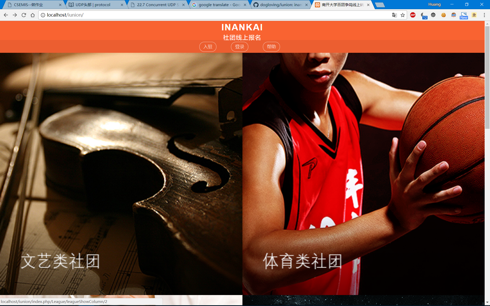

### 关于如何使用这个Project

1.  首先你要有一个`github`账号；

2. 然后你还需要一个`git`的客户端，在这里下载[链接](https://git-scm.com/downloads);

3. 下载安装好了客户端需要配置一下，怎么配置呢？看下面：

   1. 管理员模式打开`git bash`；

   2. 配置`name`和`email`，分别是`git config --global user.name "你随便取"` `git config --global user.email 你的邮箱`

   3. 配置好了客户端，你想服务器怎么知道`github`上的哪个账号对应你的哪个客户端啊，因此我们需要创建一个东西，使得你的`github`账号和你的客户端联系起来，你需要这样做:

      ```
      1. git bash中输入 cd ~/.ssh;
      2. 输入 ssh-keygen -t rsa -C "你的邮箱(和你注册GitHub的那个一样)";
      3. 输入 cat id_rsa.pub 会显示一串很长的符号，全部复制下来(可以用快捷键Ctrl+Shift+C);
      4. 把刚才复制的内容粘贴到github上，具体粘贴在哪里呢？看这里：Settings->SSH and GPG keys -> New SSH key ->自己随便取个Title 把东西粘贴在Key中;
      5. 现在你可以使用啦。
      ```

4. 进行完上面步骤之后，在桌面上右键打开`git bash`，输入`git clone git@github.com:dogloving/iunion.git`，这样你就会发现你的桌面多了一个叫`iunion`的目录。

5. 但是，这个程序的运行需要`PHP`环境，所以我们需要安装一个这个的环境，我推荐使用`XAMPP`。

   1. 去这里[链接](https://www.apachefriends.org/index.html)根据你的系统下载合适的安装包;
   2. 下载好后请将`XAMPP`安装在`C:/`或者`D:/`或者`E:/`下;
   3. 将刚才`git clone`下来的`iunion`文件夹放在`XAMPP/htdocs`目录下，然后打开`XAMPP`的控制面板，开启`Apache`服务器;
   4. 在浏览器输入`http://localhost/iunion`，你就能看到效果啦。

   